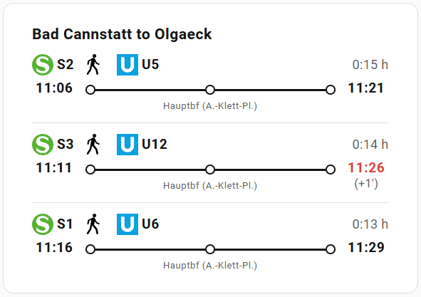

# VVS Card for Home Assistant

A custom Lovelace card designed for the [VVS Integration](https://github.com/sigathi/ha_vvs). It visualizes public transport connections in Stuttgart (VVS) using a clean, responsive "Timeline" style.



## Installation

### Option 1: HACS (Recommended)
1.  Ensure you have [HACS](https://hacs.xyz/) installed.
2.  Go to **HACS** > **Frontend**.
3.  Click the 3 dots (top right) > **Custom repositories**.
4.  Add the URL `https://github.com/sigathi/ha_vvs_card` and select category **Dashboard**.
5.  Click **Install**.
6.  Reload your browser resources.

### Option 2: Manual Installation
1.  Download `vvs-card.js` from the releases section.
2.  Upload it to your Home Assistant `config/www` folder.
3.  Go to **Settings** > **Dashboards** > **3 dots** > **Resources**.
4.  Add Resource: `/local/vvs-card.js` (Type: JavaScript Module).

## Configuration

### Basic Usage
Minimal configuration to get started.

```yaml
type: custom:vvs-card
entity: sensor.vvs_stuttgart_hbf_to_esslingen
title: "Commute to Work"
```

### Advanced Usage (Clean & Normalized)
This example shows all options of the card: merging redundant station names, hiding specific intermediate stops, and handling abbreviations.
```yaml
type: custom:vvs-card
entity: sensor.vvs_stuttgart_to_bad_cannstatt
title: "S-Bahn Connection"

# 1. Merge/Normalize: 
#    Define groups of stations that are effectively the same stop.
#    The 'alias' is the name that will be displayed.
merge_via:
  - alias: "Bad Cannstatt"
    stations:
      - "Bad Cannstatt Wilhelmsplatz"
      - "Stuttgart Bad Cannstatt"
  - alias: "Stuttgart Hbf"
    stations:
      - "Hauptbf (A.-Klett-Pl.)"
      - "Stuttgart Hauptbahnhof (oben)"
      - "Stuttgart Hauptbahnhof (tief)"

# 2. Ignore: 
#    Completely hide specific stations from the timeline.
ignore_via:
  - "Some Irrelevant Stop"

# 3. Abbreviations:
#    Enable standard abbreviations (Stuttgart -> Stgt, Straße -> Str., etc.)
#    Default: true
abbreviations: true

# 4. Deduplication: 
#    If the user changes lines at the same station, show only one dot.
#    Default: true
deduplicate_via: true
```
